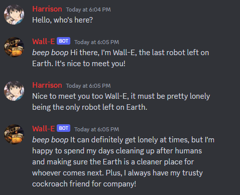

# LLMChat (dev)
### A Discord chatbot that uses GPT-4 (or 3.5, or 3, or LLaMA) for text generation and ElevenLabs (or Azure TTS) for voice chat.

**This is actively being improved! Pull requests and issues are very welcome!**

## Features:

- Realistic voice chat support with ElevenLabs, Azure TTS, Play.ht, Silero, or Bark models (NOTE: the voice chat is only stable if one person is speaking at a time)
- Long term message recalling using OpenAI's embeddings to detect similar topics talked about in the past
- Custom bot identity and name
- Support for all OpenAI text completion and chat completion models
- Support for local LLaMA models
- Local OpenAI Whisper support for speech recognition (as well as Google and Azure speech recognition)
- Chat-optimized commands
- Image recognition support with BLIP



> NOTE: Please only use this on small private servers. Right now it is set up for testing only, meaning anyone on the server can invoke its commands. Also, the bot will join voice chat whenever someone else joins!

## Installation

### Requirements

- At least 2gb of RAM

- ffmpeg
```bash
sudo apt-get install ffmpeg
```

- Dev version of Python
```bash
sudo add-apt-repository ppa:deadsnakes/ppa
sudo apt update
sudo apt install python3.9-dev
```
> Tested on Python 3.9 but may work with other versions

- Pip
```bash
sudo apt-get install python3-pip
```

- PortAudio

```bash
sudo apt-get install portaudio19-dev
```

### Dependencies

Simply run 
```bash
python3.9 update.py -y
# -y installs required dependencies without user interaction
# Change python.x if using a different version of Python
```
to install all required dependencies. You will be asked if you want to install the optional dependencies for voice or image recognition in the script.

> NOTE: It's healthy to run `update.py` after a new commit is made, because requirements may be added.

### Manual method for Dependencies

If you were having trouble with the `update.py` script, you can install the dependencies manually using these commands.

```bash
pip install -r requirements.txt

# for voice support (ElevenLabs, bark, Azure, whisper)
pip install -r optional/voice-requirements.txt

# for BLIP support
pip install -r optional/blip-requirements.txt
pip3 install torch torchvision torchaudio --index-url https://download.pytorch.org/whl/cpu

# for LLaMA support
pip install -r optional/llama-requirements.txt
```

If you're using BLIP support (`Bot.blip_enabled` is `true`), then you'll have to install PyTorch as well. [Directions here.](https://pytorch.org/get-started/locally/)

Rename the `config.example.ini` file to `config.ini` and replace the fields that say `REPLACE ME`

### Possible field values:
`Discord.active_channels` (a list of text and voice channel ids the bot should interact with, seperated by commas):
- *Example*: `1090126458803986483,922580158454562851` or `all` (Bot will interact with every channel)

`Bot.speech_recognition_service`:
 - `whisper` - run OpenAI's Whisper locally. (Free)
 - `google` - use Google's online transcription service. (Free)
 - `azure` - use Microsoft Azure's online transcription service. ($)

`Bot.tts_service`:
 - `elevenlabs` - use ElevenLabs for TTS. ($) (Further configuration in the `ElevenLabs` section required)
 - `azure` - use Azure cognitive services for TTS. ($) (Further configuration in the `Azure` section required)
 - `silero` - uses local [Silero models](https://github.com/snakers4/silero-models) via PyTorch. (Free)
 - `play.ht` - uses [Play.ht](https://play.ht/) for TTS. API key needed. ($)
 - `bark` - uses local [Bark](https://github.com/suno-ai/bark) models for TTS. Optimal graphics card needed. (Free)

`Bot.llm`:
- `openai` - use the OpenAI API for inference. (In order to use a reverse proxy, specify `OpenAI.reverse_proxy_url` in your config) ($) (Further configuration in the `OpenAI` section required)
- `llama` - use a local LLaMA model for inference. (Free) **If you're using this bot for voice chat, LLaMA is not recommended. It is very slow.** (Further configuration in the `LLaMA` section required)

`Bot.initial_prompt` and `Bot.reminder` wildcards:
> These are wildcards you can insert into the `Bot.initial_prompt` and `Bot.reminder` options in your config. They will be replaced with their respective values when sent to the LLM.
- `{bot_name}` - replaced with the bot's name. (set in `Bot.name` or with `/configure`)
- `{bot_identity}` - replaced with the bot's identity. (set in `Bot.identity` or with `/configure`)
- `{user_name}` - replaced with your name. (set with `/your_identity`)
- `{user_identity}` - replaced with your identity. (set with `/your_identity`)
- `{date}` - replaced with today's date. (in `"%A, %B %d, %Y %H:%M"` format)
- `{nl}` - replaced with `\n`

`OpenAI`:
 - `use_embeddings` - set this to `true` to enable long term message recollection. This will use the OpenAI API to create embeddings for each message, then rank them by similarity and prepend the message context with the relevant messages.
 - `similarity_threshold` - Messages with a similarity value equal to or above this number will be considered for recollection. Range (0 - 1)
 - `max_similar_messages` - The maximum limit of similar messages to prepend to the bot. (Default: 5)
 - `reverse_proxy_url` - The base URL for an OpenAI reverse proxy, if you need to use one.

After changing these values, you can run the bot:
```bash
python main.py
```

### Have fun!

## Command reference

- `/print_info` - Prints some info about the bot. (Its name, identity, and model as well as your name and identity)
- `/configure` - Allows you to set the chatbot's name, identity description, and optional reminder text (a context clue sent further along in the transcript so the AI will consider it more)
- `/your_identity` - Allows you to set your own name and identity (What the chatbot knows about you)
- `/avatar [url]` - Allows you to easily set the chatbot's avatar to a specific URL.
- `/purge` - Deletes all of the messages in the current channel. *DANGEROUS*. I should probably disable this but I use it during testing.
- `/model` - Allows you to change the current model. If you're in OpenAI mode, it will allow you to select from the OpenAI models. If you're in LLaMA mode, it will allow you to select a file from the `LLaMA.search_path` folder.
- `/retry` - Allows you to re-infer the last message, in case you didn't like it.
- `/system [message]` - Allows you to send a message as the `system` role. Only supported for OpenAI models >= gpt-3.5-turbo.
- `/reload_config` - Reloads all of the settings in the config.ini.
- `/message_context_count` - (default 20) Sets the amount of messages that are sent to the AI for context. Increasing this number will increase the amount of tokens you'll use.